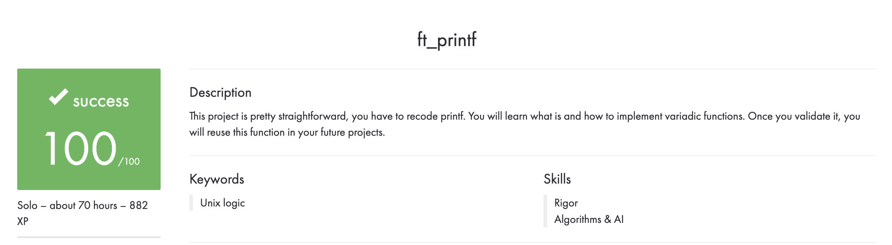

# Português 🇧🇷🇵🇹

<details>
  <summary>
    Saiba mais
  </summary>
  
  # ft_printf
Projeto da [42](https://www.42lisboa.com) - Rank 1 - ft_printf

<details>
  <summary><strong>🏆 Meu desempenho</strong></summary><br />

  
</details>

## 📌 Habilidades

> Habilidades desenvolvidas:

- Utilização de ponteiros
- Noções de endereço de memória
- Noções de alocação e dealocação de memória
- Entendimento sobre as funções variadics
- Utilização de quantidades variáveis de parametros
- Reprodução da função printf

## ‍💻 Softwares necessários

- C compiler (clang)

## ⬇️ Compilando arquivos

```bash
	make #Compila todos as funções para a biblioteca 'libftprintf.a'.
	make all #Faz exatamente a mesma coisa que apenas 'make'.
	make libftprintf.a #Faz exatamente a mesma coisa que apenas 'make'.
	#PS: Todos os comandos listados acima criam a biblioteca, além de compilar as funções. 
```

## ⚡ Testando o projeto

```
	Para testar este projeto é necessário um arquivo de teste, pode utilizar um arquivo "main.c" como base e deve-se declarar a
	biblioteca (#include "path/ft_printf.h") no arquivo de teste.
```

## Time de desenvolvimento

> Projeto individual:

<table>
    <tr>
      <td>
        
        <h4 align="center">Alê Rabelo</h4>
      </td>
    </tr>
  </table>

## 💬 Contatos

<div align="center" style="display: inline_block">
  <a href="https://www.linkedin.com/in/al%C3%AA-emmanuel-rabelo-guedes/" target="_blank">
    
  </a> 
   <a href="mailto:rabeloguedes@proton.me">
     
  </a>
</div>

</details>

# English 🇺🇸🇬🇧

<details>
  <summary>
    More
  </summary>
  
  # ft_printf
Project from [42](https://www.42lisboa.com/) - Rank 1 - ft_printf

<details>
  <summary><strong>🏆 My accomplishment</strong></summary><br />

  

</details>

## 📌 Skills

> Practiced skills:

- Usage of pointers
- Understanding of memory address
- Understanding of memory allocation and deallocation
- Understanding of variadic functions
- Usage of variable quantities of parameters
- Reproduction of the printf function


## ‍💻 Required Softwares

- C compiler (clang)

## ⬇️ Compiling files

```bash
	make #Compiles all the functions to the library 'libftprintf.a'.
	make all #Does exactly the same as just 'make'.
	make libftprintf.a #Does exactly the same as just 'make'.
	#PS: All the commands listed above create the library, besides compiling the functions.
```

## ⚡ Testing the project

```
	To test this project it is necessary a test file, you can use a file "main.c" as base and you must declare the library
	(#include "path/ft_printf.h") in the test file.
```

## Squad

> Single person project:

<table>
    <tr>
      <td>
        
        <h4 align="center">Alê Rabelo</h4>
      </td>
    </tr>
  </table>

## 💬 Contact

<div align="center" style="display: inline_block">
  <a href="https://www.linkedin.com/in/al%C3%AA-emmanuel-rabelo-guedes/" target="_blank">
    
  </a> 
   <a href="mailto:rabeloguedes@proton.me">
     
  </a>
</div>

</details>

# Deutsch 🇩🇪

<details>
  <summary>
    Mehr
  </summary>
  
  # ft_printf
Projekt von [42](https://www.42lisboa.com/) - Rank 1 - ft_printf

<details>
  <summary><strong>🏆 Meine Leistung</strong></summary><br />

  
</details>

## 📌 Fähigkeiten

> Ausgeübte Fähigkeiten:

- Verwendung von Zeigern
- Verständnis der Speicheradresse
- Verständnis der Speicherzuweisung und -freigabe
- Verständnis von Variadic-Funktionen
- Verwendung variabler Mengen von Parametern
- Reproduktion der printf-Funktion

## ‍💻 Benötigte Software

- C compiler (clang)

## ⬇️ Dateien zusammenstellen

```bash
	make #Kompiliert alle Funktionen in die Bibliothek 'libftprintf.a'.
	make all #Macht genau das gleiche wie nur 'make'.
	make libftprintf.a #Macht genau das gleiche wie nur 'make'.
	#PS: Alle oben aufgeführten Befehle erstellen die Bibliothek und kompilieren die Funktionen.
```

## ⚡ Projekt Testing

```
	Um dieses Projekt zu testen, ist eine Testdatei erforderlich. Sie können eine Datei "main.c" als Basis verwenden und müssen die Bibliothek deklarieren
	(#include "path/ft_printf.h") in der Testdatei.
```

## Entwickungsteam

> Einzelperson Projekt:

  <table>
    <tr>
      <td>
        
        <h4 align="center">Alê Rabelo</h4>
      </td>
  </table>

## 💬 Kontakt

<div align="center" style="display: inline_block">
  <a href="https://www.linkedin.com/in/al%C3%AA-emmanuel-rabelo-guedes/" target="_blank">
    
  </a> 
   <a href="mailto:rabeloguedes@proton.me">
     
  </a>
</div>

</details>
